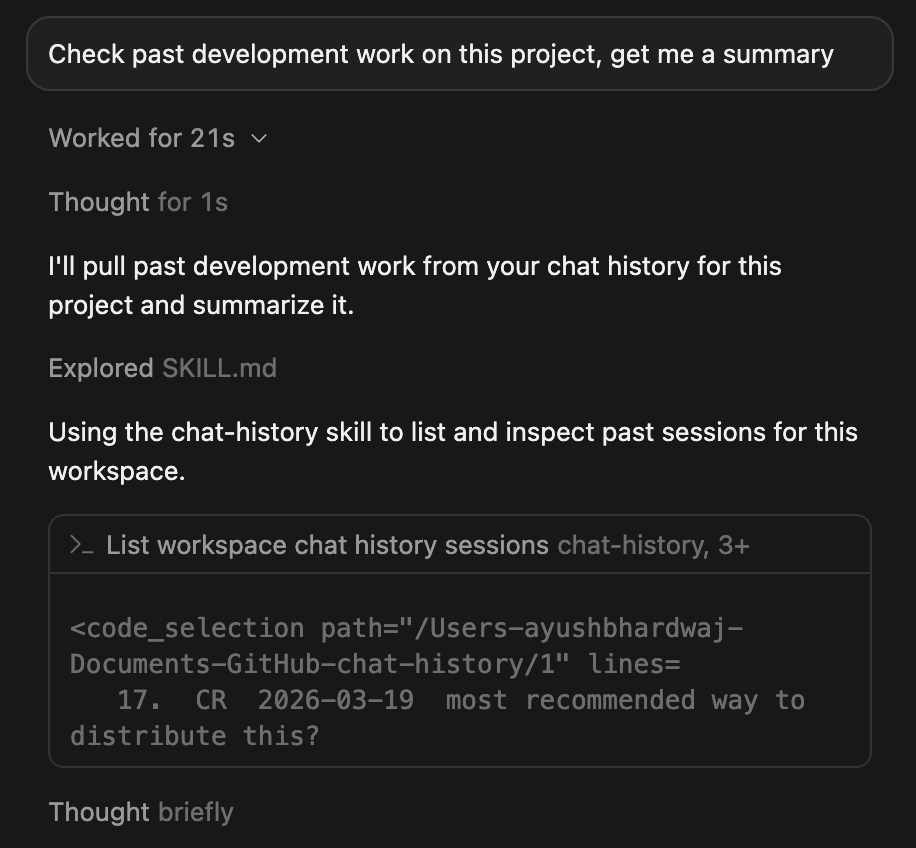

# chat-history

CLI for **agents** to search, inspect, and export **Claude Code**, **Cursor**, and **OpenAI Codex** conversation history.

Most usage is via an agent skill (`SKILL.md`) that tells Claude Code / Cursor / Codex when and how to call this tool — not interactive human browsing.



Scoring logic ported from [claude-historian-mcp](https://github.com/Vvkmnn/claude-historian-mcp), [claude-history](https://github.com/raine/claude-history), and [search-sessions](https://github.com/sinzin91/search-sessions), with Cursor transcript parsing inspired by [cursor-history](https://github.com/S2thend/cursor-history).

## Setup (for agents)

```bash
cargo install chat-history
```

`cargo install` puts `chat-history` and `ch` on `PATH` (`~/.cargo/bin/`).

The first time you run `chat-history` / `ch`, it quietly installs the bundled agent skill to:

- `~/.cursor/skills/chat-history/SKILL.md`
- `~/.claude/skills/chat-history/SKILL.md`
- `$CODEX_HOME/skills/chat-history/SKILL.md` (or `~/.codex/...`)

On Windows, the same paths are under `%USERPROFILE%`. Later CLI upgrades refresh **managed** copies automatically (those written by this CLI, tracked via a `.chat-history-managed` sidecar). User-edited skills are left alone. Skills installed by older versions without that sidecar are left alone by the quiet path — run `install-skill` once after upgrading to adopt them.

Optional explicit install / reinstall:

```bash
chat-history install-skill           # refresh managed + adopt legacy (pre-sidecar) installs
chat-history install-skill --force   # overwrite even user-edited skills
```

The skill is active immediately — no restart needed.

### Build from source

```bash
git clone https://github.com/ay-bh/chat-history.git
cd chat-history
cargo install --path .
```

Run any `chat-history` command once to install the skill (or `chat-history install-skill`).

## Agent usage

When a user asks about past conversations, recent work, or something they discussed before, call the CLI. For search, prefer JSON output so the agent can parse results reliably. `inspect` and `view` return text.

### Preferred invocations

```bash
# List recent sessions
chat-history
chat-history --from yesterday -s
chat-history -L                         # current workspace only

# Search — use --json; add --deep for full-transcript, all-scope search
chat-history search "auth error" --deep --json
chat-history search "timeout" --scope errors --json
chat-history search "trade" --scope similar --json
chat-history search <full-uuid> --json

# Summarize a session
chat-history inspect --last
chat-history inspect <partial-uuid>

# Read / export / resume / locate
chat-history view --last --plain
chat-history view <id> --tools
chat-history export <id> -o session.md
chat-history resume <id>                  # Claude Code or Codex only
chat-history find <id>                    # absolute path for further tooling
```

`ch` is a drop-in alias: `ch search "auth" --deep --json`.

### Narrowing scope

These filters apply to session listing, `search`, and `--last` selection. Explicit session-id lookups (`inspect` / `view` / `export` / `resume` / `find`) resolve by id and ignore date/source/project filters. `--sidechains` still controls whether sidechain sessions are loaded at all.

```bash
# Listing / search / --last filters
chat-history --source claude              # claude | cursor | codex
chat-history --project chat-history
chat-history --branch feature-xyz
chat-history --from "3 days ago" --to today
chat-history --sidechains                 # include hidden subagent/sidechain sessions

# Apply workspace scope to a search (-L must precede the subcommand)
chat-history -L search "auth" --deep --json

# Listing-only presentation flags
chat-history --from yesterday -s          # group by day
chat-history -k "auth" -v                 # show IDs and paths
```

Date formats: `YYYY-MM-DD`, `today`, `yesterday`, `"3 days ago"`, `"last week"`, `"last month"`.

### Search behavior for agents

| Flag | Why |
|---|---|
| `--deep` | Force full transcript search for the default `all` scope. Specialized scopes already scan transcript content. Snippets are match-centered, not message prefixes. |
| `--json` | Machine-readable search output. This flag is available on `search`, not `inspect` or `view`. |
| (default index) | Fast metadata-only search (title/summary, first prompt, branch, project). Weak results (★ < 5.0) fall through to deep search automatically. |

All JSON output uses a `{ "query", "count", "results" }` envelope. Deep-search result items include `session_id`, `source`, `date`, `summary`, `project`, `score`, `role`, `snippet`, `tools`, and `files`. Index result items include `matched_field` instead of `role`, `tools`, and `files`, and the envelope includes `"search_type": "index"`.

Scopes: `all` (default), `errors`, `similar`, `tools`, `files`. Use `--timeframe today|week|month|Nd` and `--limit N` (default 15) to constrain results.

Human-readable results include an 8-char UUID prefix (e.g. `[e363d98d]`) — pass that to `inspect`, `view`, `export`, `resume`, or `find`.

### Interpreting output

- `CC` = Claude Code, `CR` = Cursor, `CX` = Codex
- `★ N.N` = relevance (higher is better)
- `[summary]` / `[first_prompt]` / `[branch]` = which index field matched
- `inspect` → duration, messages, model, tokens, tools, files, accomplishments, key decisions
- Claude Code titles come from `ai-title` / `custom-title` JSONL when available
- Subagent/sidechain sessions are omitted unless `--sidechains`; this includes Cursor transcripts under `agent-transcripts/*/subagents/` (tagged `[subagent]`)
- Codex commentary-phase messages are hidden once a turn has a final answer; interrupted turns keep commentary

## Data sources

| Source | Path |
|---|---|
| Claude Code | `~/.claude/projects/*/*.jsonl` (+ optional legacy `sessions-index.json`) |
| Cursor | `~/.cursor/projects/*/agent-transcripts/` |
| Cursor subagents | `.../agent-transcripts/*/subagents/*.jsonl` |
| Codex | `$CODEX_HOME/sessions/YYYY/MM/DD/rollout-*.jsonl` (default `~/.codex`) |

Noise filtered automatically: warmups, handshake fluff, clear-only sessions, structural config dumps. Transcripts capped at 4MB each.

## Search scoring (summary)

**Index (default):** field-weighted — summary 3×, first prompt 2×, branch/project 1× — with recency multipliers (3× today / 2× week / 1.5× month). AND across query words.

**Deep (`--deep`):** parallel transcript parse with tech-term boosts, word/prefix/phrase scoring, separator normalization (`_`/`-`/`/` → spaces), importance/semantic boosts, dedup, and a per-session cap of 3 matches.

## Credits

- [claude-historian-mcp](https://github.com/Vvkmnn/claude-historian-mcp) — multi-signal relevance, query similarity, importance heuristics
- [claude-history](https://github.com/raine/claude-history) — prefix matching, separator normalization, recency, cwd project paths
- [search-sessions](https://github.com/sinzin91/search-sessions) — two-tier search, field weights, natural-language dates, per-session cap
- [cursor-history](https://github.com/S2thend/cursor-history) — multi-format Cursor transcript parsing

## License

MIT
